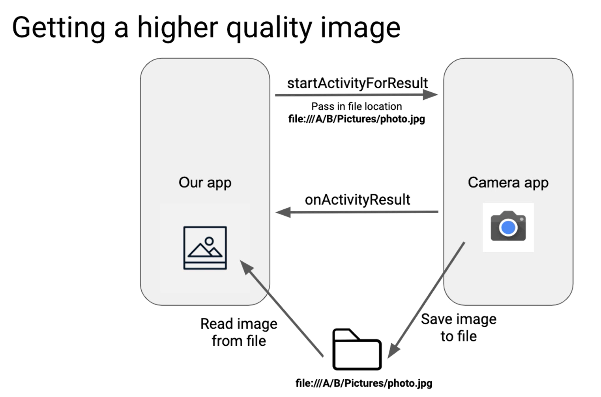

# intentCamera

    
    

    

**Linkedin:** [Shivdatt Jangam](https://www.linkedin.com/in/shivdatt-jangam-96b814254/)

Buges:
- Runs on Android version 11 and below.
- Cannot display image Captured horizontally and then oriented vertically

